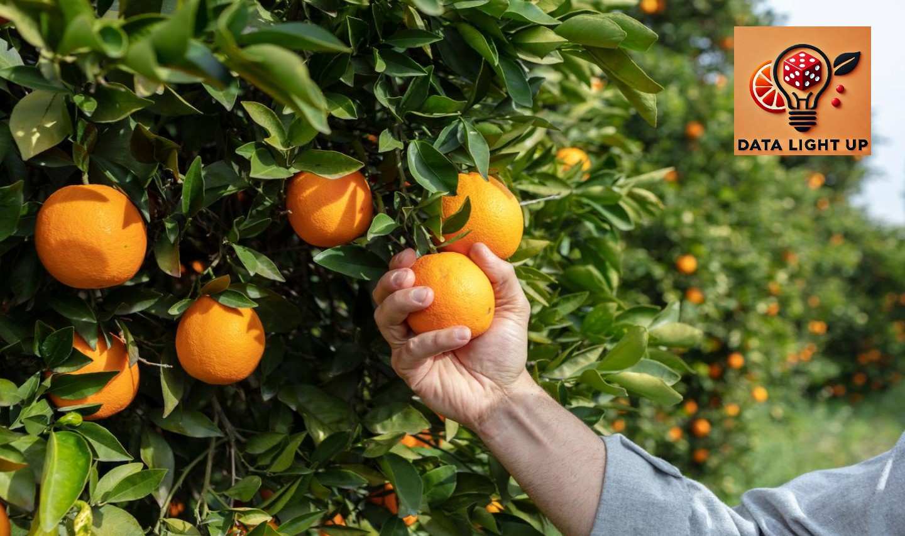

# Análise da qualidade de laranjas

  

Esse projeto tem por objetivo analisar a qualidade de laranjas com base em caracteristicas como: size (tamanho), weight (peso), brix (doçura), pH (quantidade de acidez), softness (maciez), harvestTime (tempo de colheita), ripeness (maturação), color (cor), variety (variedade), blemishes (manchas) e quality (qualidade). A análise das laranjas é essencial para garantir a satisfação do consumidor e a excelência do produto, bem como otimizar práticas agrícolas, melhorar a eficiência da produção e desenvolver novas variedades que atendam às demandas do mercado. Assim, essa análise da qualidade não só visa auxiliar uma possível melhora no produto para os consumidores, mas também fortalece a competitividade dos produtores e a sustentabilidade da cadeia produtiva.

## Justificativa

O cultivo de laranjas é uma atividade agrícola significativa que atende tanto à demanda de consumo direto quanto à produção de sucos e outros derivados. Contudo, fatores como doçura, acidez, aparência e maturação afetam diretamente a aceitação do consumidor e a qualidade percebida do produto final . Com a crescente demanda por produtos de alta qualidade no mercado nacional, torna-se essencial entender as características que influenciam a qualidade da laranja e os fatores que podem ser otimizados durante o cultivo e pós-colheita. Este projeto busca fornecer uma análise detalhada dos atributos físico-químicos e visuais das laranjas para identificar padrões que possam orientar produtores e comerciantes sobre o melhor ponto de colheita, armazenamento e apresentação, garantindo frutas com características ideais para diferentes mercados e preferências.

Neste projeto, vamos abordar as seguintes questões:

a: Como a maciez das laranjas varia com o tempo de colheita e o estágio de maturação? Laranjas mais maduras são sempre mais macias?

b: A cor das laranjas está relacionada à sua qualidade? Quais tonalidades são indicativas de maior qualidade?

c: Qual é a influência das manchas na avaliação da qualidade das laranjas?

d: Como o tempo de colheita afeta as características das laranjas? Existem períodos ideais para a colheita que maximizam a qualidade?

e: A presença de manchas afeta o pH ou a doçura das laranjas? Isso poderia indicar alguma relação entre defeitos visuais e características internas da fruta.

## Desenvolvedores

- Isabel Cristina Martins (https://github.com/IsaCristinaMartins)
- Paulo Carlos da Silva Filho (https://github.com/paulocarlosfilho)
- Roberto Augusto Silva Costa (https://github.com/RobertoAHOW)
- Sara Ferreira de Lara (https://github.com/saralvra)
- Jonas Pereira (https://github.com/jonasdspereira)

## Metodologia

O projeto será desenvolvido utilizando a metodologia CRISP-DM, seguindo os seguintes passos:

- Entendimento de negócio
- Entendimento de dados
- Preparação dos dados
- Modelagem

O projeto também é dividido em duas entregas, a saber:

- Análise Exploratória de Dados (EDA): entendimento das variáveis que influenciam o MPG e identificação de padrões nos dados através de hipóteses, visualizações e insights.
- Análise comparativa de modelos: construção de modelos de aprendizado de máquina para previsão de consumo, com métricas de desempenho para avaliação da performance.

## Resultados Esperados

A: Espera-se observar uma correlação positiva entre a maciez e o estágio de maturação; ou seja, laranjas mais maduras tendem a ser mais macias. No entanto, pode haver variações dependendo da variedade.

B: Espera-se encontrar uma associação entre a cor das laranjas e sua qualidade, onde tonalidades de laranja mais vibrantes (mais próximas do amarelo-alaranjado) são indicativas de maior qualidade.

C: É provável que a presença de manchas (blemishes) tenha um impacto negativo na avaliação da qualidade das laranjas. As laranjas com manchas podem ser classificadas com menor qualidade, independentemente de outros parâmetros como doçura e acidez.

D: Espera-se que o tempo de colheita afete significativamente as características das laranjas, com a identificação de períodos ideais que maximizam a qualidade em termos de sabor, textura e aparência.

E: É provável que laranjas com manchas podem ter pH mais baixo (maior acidez) e menor doçura, indicando possíveis processos de degradação que afetam a qualidade interna. A presença de manchas pode assim refletir mudanças na acidez e noçura da fruta.

## Dicionário de dados

Arquivo em formato .csv presente no diretório ../data/external/dicionario_de_dados_laranjas.csv
